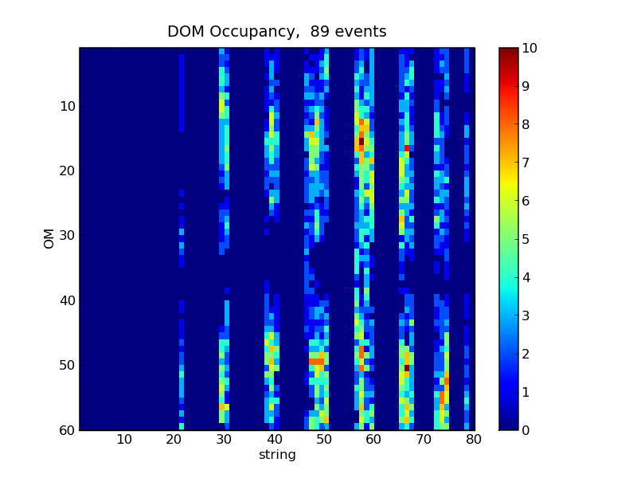
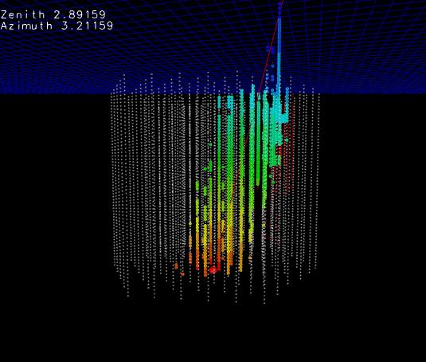

Scripts
-------

These scripts are located in $I3_SRC/examples/python/scripts.

.. automodule:: icecube.examples.scripts
   
Demonstration of core icetray functionality
^^^^^^^^^^^^^^^^^^^^^^^^^^^^^^^^^^^^^^^^^^^

.. autofunction:: icecube.examples.scripts.A0_new_config_syntax.main

.. autofunction:: icecube.examples.scripts.A1_pass_i3int_to_module.main

.. autofunction:: icecube.examples.scripts.B0_pass_function_to_i3tray.main

.. autofunction:: icecube.examples.scripts.B2_pass_closure_to_i3tray.main

.. autofunction:: icecube.examples.scripts.B3_filter_with_function.main

.. autofunction:: icecube.examples.scripts.D_module_in_python.main

.. autofunction:: icecube.examples.scripts.E_module_fancy_parameter_in_python.main

.. autofunction:: icecube.examples.scripts.F_use_randomservice.main

.. autofunction:: icecube.examples.scripts.G_pass_randomservice_as_param_to_cpp_module.main

.. autofunction:: icecube.examples.scripts.H_pass_randomservice_as_param_to_pymodule.main

.. autofunction:: icecube.examples.scripts.I_cpp_uses_python_impl_of_randomservice.main

More physicsy stuff
^^^^^^^^^^^^^^^^^^^

.. autofunction:: icecube.examples.scripts.J_autoupdating_histogram.main

.. autofunction:: icecube.examples.scripts.K_delang_plot.main

.. autofunction:: icecube.examples.scripts.L_PyLessDumbFeatureExtractor.main

.. autofunction:: icecube.examples.scripts.dom_occupancy.main

.. autofunction:: icecube.examples.scripts.make_cherenkov_cone.main

   Generated event looks something like:

   
